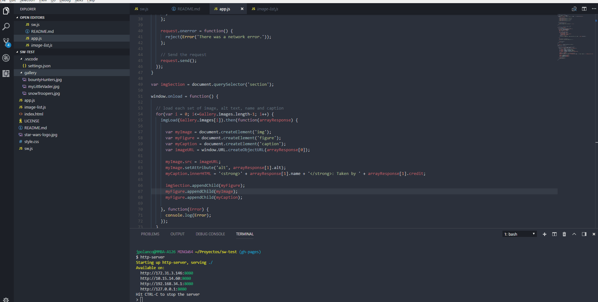

# Presentation mode

A simple plugin to show your code properly in a presentation

](https://marketplace.visualstudio.com/items?itemName=jspolancor.presentationmode)
](https://marketplace.visualstudio.com/items?itemName=jspolancor.presentationmode)
](https://marketplace.visualstudio.com/items?itemName=jspolancor.presentationmode)

## Usage

Run the presentation mode command to toggle it. ESC to exit.



## Configuration

You can change the zoom level in presentation mode in your settings

```json
{
    "presentationMode.zoomLevel": 4,
}
```